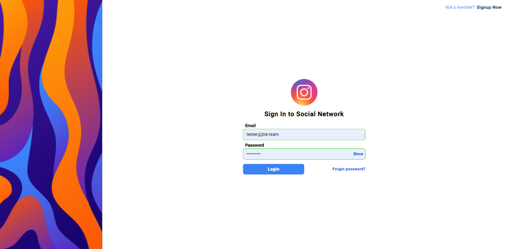
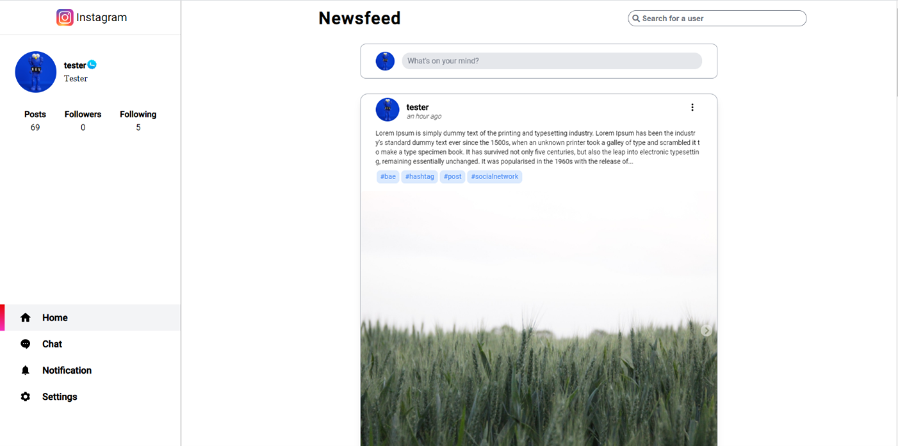
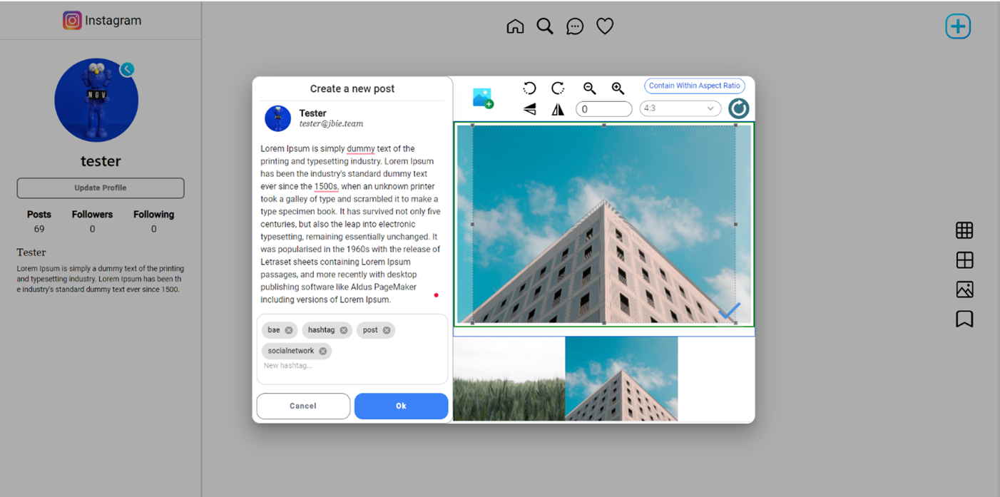
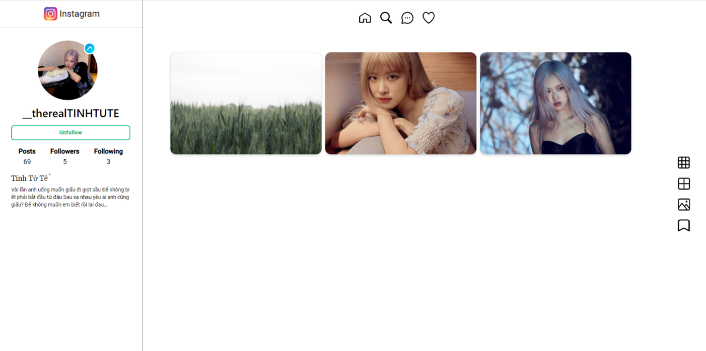
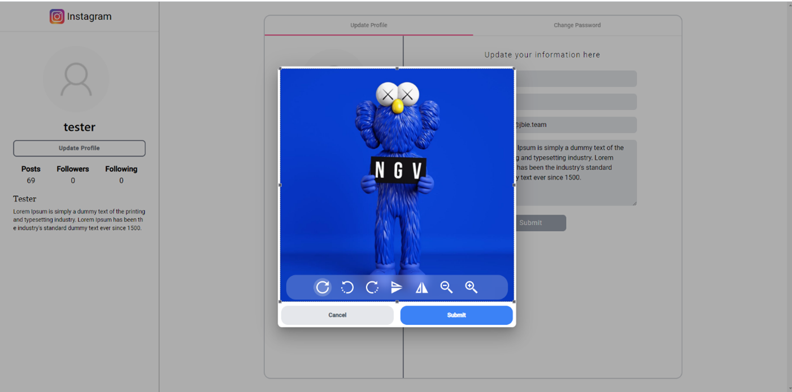
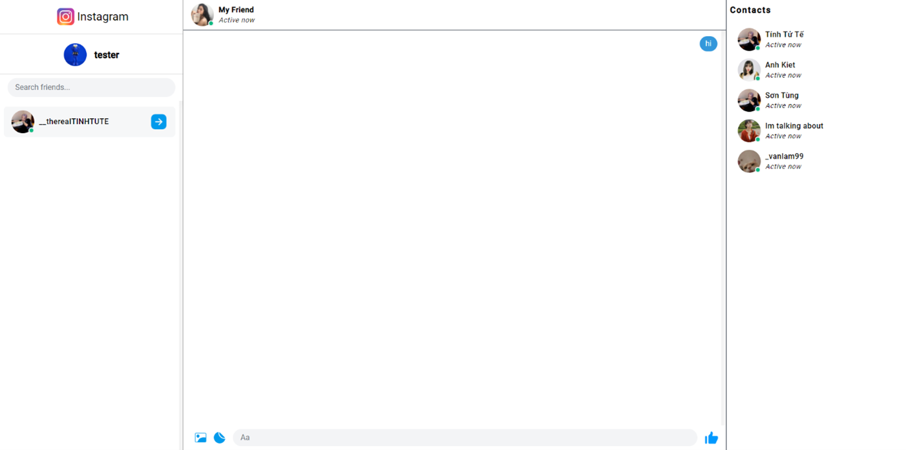

## Description
We built a social network like Instagram for final project on school.
This project was generated with [Angular CLI](https://github.com/angular/angular-cli) version 11.2.5.

## Development server

Run `ng serve` for a dev server. Navigate to `http://localhost:4200/`. The app will automatically reload if you change any of the source files.

## Build

Run `ng build` to build the project. The build artifacts will be stored in the `dist/` directory. Use the `--prod` flag for a production build.

## Screenshots
* Login

* Newsfeed with all post from friends

* Create a new media post

* User's Profile

* Upload Or change user's avatar

* Messenger, chat with friends

